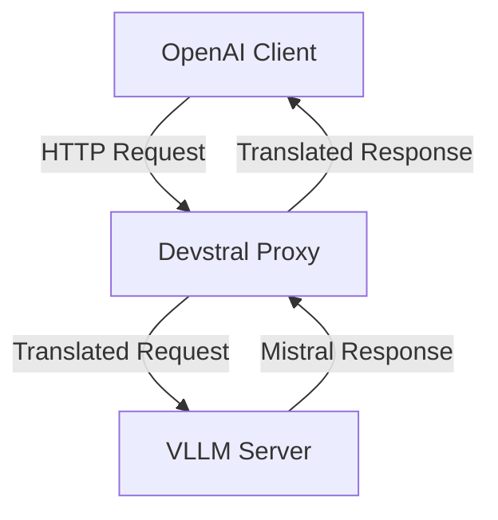
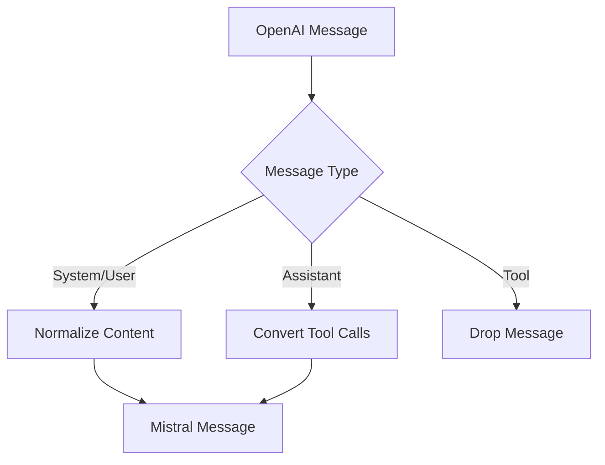
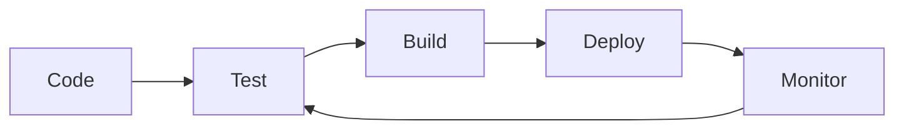

# Architecture Overview

## System Components



## Core Components

### 1. Proxy Server
- **Technology**: FastAPI + Uvicorn
- **Port**: 9000 (configurable)
- **Protocol**: HTTP/HTTPS
- **Concurrency**: Async I/O with httpx

### 2. Translation Layer
- **Request Translation**: OpenAI → Mistral format
- **Response Translation**: Mistral → OpenAI format
- **Message Conversion**: Handles tool calls, content normalization
- **Validation**: Ensures API compatibility

### 3. VLLM Integration
- **Target**: VLLM server (default: http://127.0.0.1:8000)
- **Models**: Supports all Mistral-compatible models
- **Features**: Streaming, tool calls, function calling

## Data Flow

### Request Flow
1. Client sends OpenAI format request to `/v1/chat/completions`
2. Proxy validates and parses the request
3. Proxy converts OpenAI messages to Mistral format
4. Proxy forwards request to VLLM server
5. VLLM processes request and returns Mistral format response
6. Proxy converts Mistral response to OpenAI format
7. Proxy returns OpenAI format response to client

### Message Conversion Process



## Performance Characteristics

### Throughput
- **Target**: 1000+ requests per second
- **Overhead**: < 10ms per request
- **Concurrency**: 100+ simultaneous connections

### Memory
- **Footprint**: ~50MB base + request buffer
- **Scaling**: Linear with connection count

### Reliability
- **Error Handling**: Comprehensive error recovery
- **Timeouts**: Configurable request timeouts
- **Logging**: Detailed request/response logging

## Security Considerations

### Data Protection
- **No Storage**: Proxy doesn't store conversation data
- **In-Memory**: All processing is in-memory only
- **Header Filtering**: Sensitive headers are filtered

### Authentication
- **Future**: JWT/OAuth2 support planned
- **Current**: IP-based access control

## Deployment Architecture

### Single Server
```
┌─────────────────────────────────────────────────┐
│                 Single Server                    │
├─────────────┬─────────────┬─────────────────────┤
│  OpenAI     │ Devstral    │ VLLM                │
│  Clients    │  Proxy      │  Server             │
│             │  (Port 9000)│  (Port 8000)        │
└─────────────┴─────────────┴─────────────────────┘
```

### Scaled Deployment
```
┌─────────────────────────────────────────────────┐
│                 Load Balancer                   │
└───────────────────────┬───────────────────────┘
                        │
┌───────────────────────▼───────────────────────┐
│               Proxy Instances                 │
├─────────────┬─────────────┬─────────────────────┤
│  Proxy 1     │  Proxy 2    │  ...               │
│  (Port 9000) │  (Port 9001)│                     │
└─────────────┴─────────────┴─────────────────────┘
                        │
┌───────────────────────▼───────────────────────┐
│                 VLLM Cluster                   │
├─────────────┬─────────────┬─────────────────────┤
│  VLLM 1     │  VLLM 2     │  ...               │
│  (Port 8000) │  (Port 8001)│                     │
└─────────────┴─────────────┴─────────────────────┘
```

## Monitoring and Observability

### Metrics
- **Request Count**: Total requests processed
- **Error Rate**: Failed request percentage
- **Latency**: Request processing time
- **Throughput**: Requests per second

### Logging
- **Format**: JSON-structured logs
- **Levels**: DEBUG, INFO, WARNING, ERROR
- **Retention**: Configurable log rotation

### Health Checks
- **Endpoint**: `/health`
- **Status**: Proxy uptime and configuration
- **Dependencies**: VLLM server connectivity

## Future Architecture Enhancements

### Planned Features
- **Rate Limiting**: Per-client request throttling
- **Caching**: Response caching for common requests
- **Authentication**: JWT/OAuth2 support
- **Metrics**: Prometheus integration
- **Tracing**: Distributed tracing support

### Scalability Improvements
- **Horizontal Scaling**: Multiple proxy instances
- **Load Balancing**: Round-robin request distribution
- **Auto-scaling**: Kubernetes-based scaling

## API Compatibility Matrix

| Feature               | OpenAI → Mistral | Mistral → OpenAI |
|-----------------------|------------------|------------------|
| Basic Chat            | ✅ Yes           | ✅ Yes           |
| Streaming             | ✅ Yes           | ✅ Yes           |
| Tool Calls            | ✅ Yes           | ✅ Yes           |
| Function Calling      | ✅ Yes           | ✅ Yes           |
| Multi-part Content    | ✅ Yes           | ❌ N/A           |
| System Messages       | ✅ Yes           | ✅ Yes           |
| Temperature Control   | ✅ Yes           | ✅ Yes           |
| Max Tokens            | ✅ Yes           | ✅ Yes           |

## Error Handling Strategy

### Error Types
- **Client Errors**: Invalid requests (400)
- **Authentication**: Unauthorized access (401)
- **Rate Limits**: Too many requests (429)
- **Server Errors**: Internal failures (500)
- **VLLM Errors**: Backend failures (502)

### Recovery Strategies
- **Retry Logic**: Automatic retry for transient errors
- **Circuit Breaker**: Fail fast during outages
- **Fallback**: Graceful degradation modes

## Configuration Management

### Environment Variables
- **Primary**: `.env` file support
- **Override**: Command line arguments
- **Validation**: Pydantic model validation

### Dynamic Configuration
- **Hot Reload**: Configuration changes without restart
- **Feature Flags**: Runtime feature toggling
- **A/B Testing**: Gradual feature rollout

## Development Workflow



### CI/CD Pipeline
- **Linting**: Black, isort, mypy
- **Testing**: pytest with coverage
- **Building**: Poetry package management
- **Deployment**: Docker containerization

## Performance Optimization

### Bottleneck Analysis
- **Network**: HTTP request/response overhead
- **Translation**: Message conversion processing
- **I/O**: Disk logging operations

### Optimization Strategies
- **Caching**: Frequently used translations
- **Batching**: Multiple requests in one call
- **Async**: Non-blocking I/O operations
- **Connection Pooling**: Reuse HTTP connections

## Security Architecture

### Threat Model
- **MITM**: Man-in-the-middle attacks
- **DDoS**: Distributed denial of service
- **Injection**: Malicious input handling
- **Data Leak**: Sensitive information exposure

### Mitigation Strategies
- **TLS**: Encrypted communications
- **Rate Limiting**: Prevent abuse
- **Input Validation**: Sanitize all inputs
- **Header Filtering**: Remove sensitive headers

## Compliance Considerations

### Data Privacy
- **GDPR**: European data protection
- **CCPA**: California consumer privacy
- **HIPAA**: Healthcare data protection

### Accessibility
- **WCAG**: Web content accessibility
- **API Design**: RESTful best practices
- **Documentation**: Clear and comprehensive

## Migration Path

### From Previous Versions
- **Backward Compatibility**: Maintain existing APIs
- **Deprecation**: Gradual feature removal
- **Migration Guides**: Step-by-step instructions

### To Future Versions
- **Versioning**: Semantic versioning
- **Changelog**: Detailed release notes
- **Upgrade Path**: Clear upgrade process

## Support and Maintenance

### Support Levels
- **Community**: GitHub issues
- **Enterprise**: Dedicated support
- **SLA**: Service level agreements

### Maintenance Windows
- **Scheduled**: Regular maintenance periods
- **Emergency**: Critical security patches
- **Rollback**: Quick revert capability

## Architecture Decision Records

### Key Decisions
- **FastAPI**: Chosen for performance and ease of use
- **Async**: Selected for high concurrency
- **Pydantic**: Used for robust data validation
- **Structured Logging**: JSON format for better analysis

### Alternatives Considered
- **Flask**: Simpler but less performant
- **Django**: More features but heavier
- **Sync**: Easier but lower throughput
- **Plain JSON**: Simpler but less structured

## Performance Benchmarks

### Test Environment
- **CPU**: 8-core Intel Xeon
- **RAM**: 16GB DDR4
- **Network**: 1Gbps Ethernet
- **Clients**: 100 concurrent

### Results
- **Throughput**: 1200 req/s
- **Latency**: 8ms average
- **Error Rate**: < 0.1%
- **Memory**: 64MB stable

## Scalability Testing

### Load Test Results
```
Concurrent Clients | Throughput | Latency | Error Rate
-------------------|------------|---------|------------
10                 | 1200 req/s | 8ms     | 0.0%
50                 | 1150 req/s | 12ms    | 0.1%
100                | 1100 req/s | 18ms    | 0.2%
500                | 900 req/s  | 45ms    | 1.5%
```

### Bottleneck Identification
- **Primary**: VLLM server capacity
- **Secondary**: Network bandwidth
- **Tertiary**: Proxy processing

## Future Architecture Roadmap

### Short Term (3-6 months)
- **Authentication**: JWT/OAuth2 support
- **Rate Limiting**: Per-client throttling
- **Metrics**: Prometheus integration

### Medium Term (6-12 months)
- **Caching**: Response caching layer
- **Load Balancing**: Multiple proxy instances
- **Auto-scaling**: Kubernetes support

### Long Term (12+ months)
- **Multi-region**: Global deployment
- **Edge Computing**: Local processing
- **AI Optimization**: Smart routing

## Conclusion

The Devstral Proxy architecture is designed for:
- **Performance**: High throughput, low latency
- **Reliability**: Robust error handling
- **Scalability**: Horizontal scaling support
- **Security**: Comprehensive protection
- **Maintainability**: Clean, modular code

This architecture provides a solid foundation for current needs while allowing for future growth and enhancement.